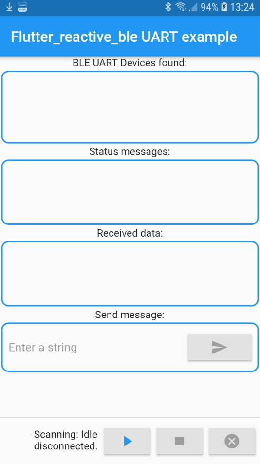

# flutter reactive BLE UART demo app

This demo app shows an usecase for using flutter_reactive_ble library for building a UART emulation over BLE.

This demo app uses one service: the Nordic UART Service. 

The 128-bit vendor-specific UUID of the Nordic UART Service:

```
Uuid _UART_UUID = Uuid.parse("6E400001-B5A3-F393-E0A9-E50E24DCCA9E");
```

The aforementioned service uses two characteristics: one for transmitting and one for receiving (as seen from the peer).

```
Uuid _UART_RX   = Uuid.parse("6E400002-B5A3-F393-E0A9-E50E24DCCA9E");
Uuid _UART_TX   = Uuid.parse("6E400003-B5A3-F393-E0A9-E50E24DCCA9E");
```

## Usage

This app can be used if the BLE peripheral implements the aforementioned services. The user interface is shown below:




